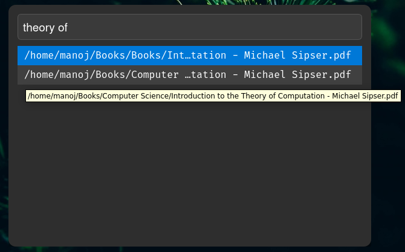
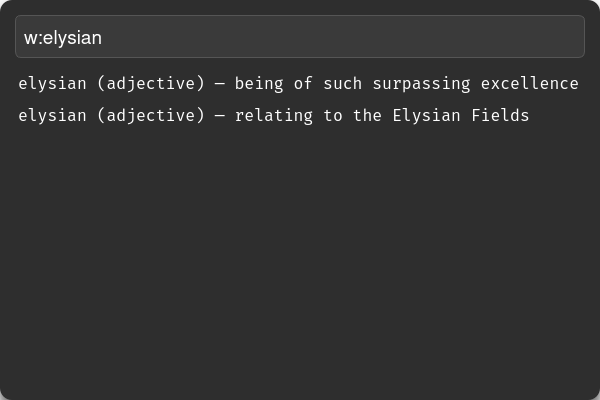

<h1 align="center">🐾 Simba Launcher</h1>

<p align="center">
  <em>A minimal, elegant, and intelligent desktop launcher for Linux — built with Python (PyQt5).</em><br>
  <em>Fast search. Offline dictionary. Beautiful design.</em>
</p>

<p align="center">
  
  
  
  
</p>
<br>

---

## ✨ Overview

**Simba Launcher** is a lightweight, privacy-first desktop launcher designed for Debian/Linux systems.  
It combines **fast local file search**, **keyboard-centric navigation**, and an **offline WordNet-based dictionary** — all wrapped in a clean, futuristic PyQt5 interface.

Originally built as a personal productivity tool and learning project, Simba is engineered to be:
- **Intelligent** – unified search + dictionary mode (`w:word`)
- **Minimal** – clean UI, centered window, smooth fade-in
- **Fast & Offline** – instant search, no network or telemetry
- **Extensible** – modular core (indexing, search, dictionary)

<br>

---


## 🧭 Features (v1.0 beta)

✅ **Instant file search**
  
- **Recursive indexing from configurable directories** in (`config.json`)  
- **Case-insensitive substring matching**  
- **Keyboard-only operations** : Up/Down arrows, Enter to open, Esc to hide  

✅ **Dictionary mode**
- **Dictionary mode:** Type `w:word` or `w>word` to search **offline WordNet definitions** (shipped as `data/wordnet.json`)  
- Displays multiple **meanings with parts of speech (noun, verb, adjective, adverb)**  
- Full definition available via tooltip  

✅ **Elegant UI**
- **Frameless, translucent window with drop shadow**  
- Smooth **fade-in animation** on launch  
- Dark minimal aesthetic — **distraction-free design**  

✅ **Privacy-First**
- **100% offline** — no internet or background telemetry  
- **Configurable file paths, no external dependencies**  

<br>

---

## Screenshots / Previews

- #### Live Demo (Hotkey : ctrl + space)


- #### Search Results




## 🧠 Dictionary Integration (WordNet)
  



  > Simba uses a local snapshot of Princeton WordNet

-  The JSON dataset (`data/wordnet.json`) is pre-parsed and loaded once at startup for instant offline lookups.

    
    - To regenerate your own:
 
```bash
python3 -m nltk.downloader wordnet
```

then convert using `tools/export_wordnet.py` (to be added)

<br>


## 💡 Design Philosophy

> **“Build tools that disappear — until you need them.”**

- Simba embodies **minimalism and responsiveness.**
- Every decision — from color palette to keybindings — is shaped by **speed, clarity, and quiet intelligence.**
- In its simplicity, its an exploration into ***human-computer harmony.***

<br>

## 📦 Tech Stack

- **Language:** Python 3.10+

- **Framework:** PyQt5 (UI)

- **Core Modules:** os, subprocess, json

- **Dataset:** WordNet (offline JSON)

- **Platform:** Linux (GNOME tested on Debian)

<br>


## ⚙️ Installation & Setup

### 1. Clone the repository
```bash
git clone https://github.com/m4noj/simba-launcher.git
cd simba-launcher
```

### 2. Create virtual environment (Optional)
```bash
python3 -m venv simba
source venv/bin/activate
pip install -r requirements.txt
```
### 3. Edit `config.json`

Example:
```bash
{
  "search_paths": ["~/Downloads","~/Documents"],
  "max_results": 20
}
```
### 4. Run
```bash
python3 main.py
```
<br>

## Usage

- Just start typing to search files.

- Use arrow keys Up/Down to navigate, Enter to open.

- Press Esc to hide the launcher.

- Type `w:[word here]` to search the dictionary offline.

<br>

---

## 🪶  GNOME Integration

- Create a launcher shortcut:

   `~/.local/share/applications/simba-launcher.desktop`

```ini
[Desktop Entry]
Name=Simba Launcher
Exec=/usr/bin/python3 /home/[user]/simba-launcher/main.py
Icon=system-search
Type=Application
Terminal=false
Categories=Utility;
```

- Then to auto-start on login:

```bash
mkdir -p ~/.config/autostart
cp ~/.local/share/applications/simba-launcher.desktop  ~/.config/autostart/
```

  You can also bind it to a **global hotkey (Ctrl + Space)** via GNOME Settings → Keyboard → Shortcuts.

<br>


## Future & Vision

| Version  | Features Planned                                                                 |
| -------- | -------------------------------------------------------------------------------- |
| **v1.1** | Plugin framework, better daemon integration, cross-platform build                |
| **v1.2** | Usage-based ML ranking, smart command mode (`calc:`, `def:`, etc.)               |
| **v1.3** | Fuzzy search (Levenshtein / TF-IDF ranking), incremental index, dictionary popup |

<br>

---
